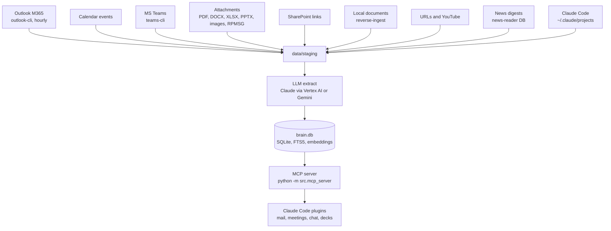

# second-brain

Personal knowledge repository and MCP data layer. It ingests emails, attachments, calendar events, Teams messages, SharePoint documents, news digests, and Claude Code conversation history into a SQLite database (`brain.db`), then exposes that store to Claude Code plugins via a Model Context Protocol (MCP) server.

The point: give the agent recall over years of institutional context (people, decisions, action items, topics, key facts) without re-reading every message on every turn.

[](https://github.com/weirdapps/plessas-second-brain/actions/workflows/ci.yml)
[](LICENSE)

Python 3.12+. MIT-licensed. Maintained by [@weirdapps](https://github.com/weirdapps).

## What it does

Four stages, run on a schedule:

1. **Ingest.** Pull new mail, attachments, calendar events, Teams messages, SharePoint links, standalone documents, URLs, YouTube transcripts, news digests, and Claude Code conversations into `data/staging/`.
2. **Extract.** Send raw content through an LLM (Claude via Vertex AI by default; Gemini optional) to produce structured JSON: summary, sentiment, urgency, topics, decisions, action items, people, key facts.
3. **Load.** Write rows into SQLite with FTS5 full-text indexes, embedding vectors, and thread reconstruction. Schema migrations run automatically.
4. **Serve.** Expose the store as MCP tools that Claude Code plugins (`mail`, `meetings`, `chat`, `decks`, and more) call directly.

## Architecture



## Ingestion sources

| Source | Module | Notes |
| --- | --- | --- |
| Microsoft 365 mail | `src/export/outlook_export.py` + `outlook_cli.py` | Primary. Hourly, `--since` cursor. |
| Apple Mail archive | `src/export/apple_mail.py` | Frozen. Kept for historical rollback. |
| Attachments | `src/export/outlook_attachments.py`, `src/extract/attachment_extractors.py` | PDF (PyMuPDF), DOCX (`python-docx`), PPTX (`python-pptx`), XLSX (`openpyxl`), XLSB (`pyxlsb`), XLS (`xlrd`), images (Tesseract OCR), EML, RPMSG (`compoundfiles`). |
| Inline email images | `src/extract/image_classifier.py`, `image_pipeline.py`, `image_vision.py` | Dimensions plus bytes plus sender-scoped SHA256 dedup cascade; vision LLM stage for content images, cached by SHA256. |
| Calendar events | `src/export/calendar_export.py`, `src/extract/calendar_extractor.py` | Outlook events with attendees, body summary, decisions. |
| MS Teams | `src/export/teams_cli.py`, `teams_export.py`, `src/extract/teams_pipeline.py` | Chats, threads, messages, MRI resolution. |
| SharePoint links | `src/extract/sharepoint_url_scanner.py`, `src/export/sharepoint_fetcher.py` | Managed host defaults to `contoso.sharepoint.com` (override via `SHAREPOINT_HOST`). |
| Standalone documents | `src/cli.py ingest`, `reverse-ingest`, `src/ingest/reverse_scan.py` | Latest-version-per-logical-name dedup. |
| Web and YouTube | `src/extract/web_ingest.py` | URL fetch plus transcript pull via `youtube-transcript-api`. |
| News digests | `src/export/news_export.py` | Reads an external news-reader SQLite DB (`BRAIN_NEWS_DB`) read-only. Digest syntheses plus articles at or above `--relevance`. Landed under `mailbox_name = 'News'`, so mail counts exclude them. |
| Claude Code sessions | `src/export/conversation_export.py` | Reads `~/.claude/projects`. |

### Bring your own source

The extract → load → serve chain is **source-agnostic**: it only reads staging batches from `data/staging/batch-*.json`. The Microsoft 365 adapters above are just one way to fill that folder. To ingest from any other system (Gmail, IMAP, an `.mbox`, a custom API), write a small exporter that emits the same JSON shape. No other code changes are needed.

A staging batch is `{ "batch_number", "exported_at", "source", "folder", "emails": [ … ] }`, where each email record is:

```json
{
  "message_id": "any-stable-unique-id",
  "date_received": "2026-01-15T09:00:00Z",
  "subject": "…",
  "sender":        { "name": "…", "address": "…" },
  "to_recipients": [{ "name": "…", "address": "…" }],
  "cc_recipients": [],
  "mailbox_name": "Inbox",
  "content": "plain-text or HTML body",
  "conversation_id": "optional, for threading",
  "internet_message_id": "optional, for cross-source dedup"
}
```

See [`examples/example_exporter.py`](examples/example_exporter.py) for a ~40-line reference exporter and [`examples/sample-batch.json`](examples/sample-batch.json) for a complete synthetic batch. Drop a batch into `data/staging/`, then run `python -m src.cli sync` (or `load`) to extract and index it.

## MCP tools

The MCP server exposes 23 tools (all defined in `src/mcp_server.py`). Register the server once in `~/.claude/settings.json`, then every session picks them up.

### Unified recall

- `recall(query, limit_per_kind, days)`. Fan-out across every text-bearing index, plus auto-pulled person and topic context. This is the default "tell me everything you know about X" entry point.

  Nine result buckets, keyed exactly as returned: `emails` (which also covers standalone documents and news, since they share the `emails` table), `attachments`, `conversations`, `decisions`, `actions`, `commitments`, `inline_images`, `teams`, `calendar_events`. `summary.kinds_with_results` names the ones that matched.

  Only the `emails` bucket is a keyword plus semantic fusion (reciprocal rank fusion over FTS5 and embedding hits, degrading to keyword-only if the index or credentials are absent). Every other bucket is keyword-only. When the local database is behind, the response carries `_stale_warning` and `data_as_of`.

### Emails

- `search_emails(query, search_type, limit)`. Keyword (FTS5) or semantic (embedding).
- `query_emails(person, topic, keyword, start_date, end_date, limit)`. Combined filters.
- `outlook_live_search(folder, since_minutes, subject_contains)`. Bypasses the DB and queries the live Outlook mailbox directly, for mail newer than the store. `since_minutes` defaults to 60. This is the escape hatch when `stats` says the local copy is stale.

### People and topics

- `person_context(name_or_email, days, limit)`. History, sentiment, decisions, open actions, communication pattern. Each list is capped at `limit` (default 20) and carries a `<name>_total` sibling with the real count, so a truncated answer is distinguishable from a complete one.
- `topic_context(topic, days, limit)`. Key people, decisions, actions, facts. Same `limit` and `<name>_total` contract.
- `sender_brief(name_or_email, days)`. Compact briefing suitable for inline display.
- `meeting_prep(people, topic, days)`. Per-attendee dossiers, optionally scoped to a topic.

### Decisions and actions

- `query_decisions(topic, person, days, limit)`.
- `query_actions(owner, status, limit)`.
- `stale_threads(days, limit)`. Threads awaiting reply plus overdue action items (`overdue_actions_total` is the untruncated count). The stale-thread half needs `BRAIN_USER_EMAIL_PATTERN`; without it that half is always empty and the response says so.

### Attachments and images

- `search_attachments(query, limit)`. FTS over extracted text and LLM summaries.
- `attachment_image_search(query, limit)`. LIKE match on vision descriptions of classified content images.

### Calendar

- `query_calendar_events(person, since, until, keyword, limit)`.

### Teams

- `search_teams(query, kind, limit)`. Thread summaries, message text, or both.
- `teams_thread_context(thread_id)`. Full thread with decisions, actions, facts.
- `teams_chat_summary(chat_id, days)`. Recent activity per chat or channel.

### SharePoint

- `sharepoint_index(operation, url)`. `list_stale` (any link whose `last_status` is not `ok`), `list_unfetched`, or `refetch` a specific URL.

  `refetch` accepts only a URL already present in `sharepoint_links` and only on the configured `SHAREPOINT_HOST`. Both checks matter: the URL reaches `sharepoint-cli --host` and the CLI will point the stored session, cookies included, at whatever host it is given. Since search results carry attacker-authored subject and body text to the model, an unconstrained refetch is a route for sending your SharePoint session to a tenant someone else controls.

### Claude Code conversation memory

- `search_conversations(query, search_type, workspace, limit)`.
- `conversation_context(session_id)`.
- `recall_preference(topic, limit)`. Surface prior user preferences and corrections extracted from past sessions.
- `recent_conversations(workspace, days, limit)`.

### Stats

- `stats()`. Counts across emails, news articles, standalone documents, conversations, topics, people, decisions, actions, attachments, key facts and calendar events, plus the corpus date range.

  It also returns `data_as_of`, `age_hours` and `stale`, read from the `last_sync_date` cursor. On a read replica that is the only way to tell a live corpus from one whose feed stopped, because both answer queries identically.

## Installation

Requires Python 3.12+ and, if you ingest attachments, two system packages that `pip` cannot install:

- **`tesseract` plus its language data.** Attachment OCR calls `pytesseract.image_to_string(img, lang="eng+ell")`, so the English *and* Greek traineddata must both be present or every image and scanned PDF fails. `pytesseract` is a wrapper around the binary, not the binary. In a corpus with scanned documents in it, OCR ends up the most common extraction method of all.
- **`zstd` and `openssl`**, only if you want the encrypted offsite backups from `scripts/backup_db.py`. Missing either one silently downgrades to local-snapshot-only.

```bash
brew install tesseract tesseract-lang                  # macOS
sudo apt-get install tesseract-ocr tesseract-ocr-ell   # Debian/Ubuntu
tesseract --list-langs | grep -x ell                   # verify the Greek pack
```

Microsoft 365 ingestion needs three separate open-source CLIs, one per surface: [`outlook-cli`](https://github.com/weirdapps/outlook-access) for mail, attachments and calendar, [`teams-cli`](https://github.com/weirdapps/teams-access) for Teams, and [`sharepoint-cli`](https://github.com/weirdapps/sharepoint-access) for SharePoint reference links. They share no session and each logs in separately. Everything else (local documents, URLs, YouTube, news, Claude Code conversations, or your own exporter) works without any of them.

```bash
# HTTPS (no SSH key required):
git clone https://github.com/weirdapps/plessas-second-brain.git
# or, with SSH:
git clone git@github.com:weirdapps/plessas-second-brain.git

cd plessas-second-brain

python3.12 -m venv .venv
source .venv/bin/activate

# uv is the canonical package manager (uv.lock is committed):
uv pip install -e ".[dev]"

# pip also works:
pip install -e ".[dev]"
```

## Configuration

Read from environment variables (shell profile or `.env`). Only identity plus one extraction path (Vertex or Gemini) is strictly required.

### Identity

Used in extraction prompts and stale-thread detection.

- `BRAIN_USER_NAME`
- `BRAIN_USER_ROLE`
- `BRAIN_USER_EMAIL_PATTERN` (case-insensitive substring, matched against `sender_address` to detect your sent mail)

### Extraction engine

- `BRAIN_EXTRACT_ENGINE`: `claude` (default) or `gemini`.
- `CLAUDE_EXTRACT_MODEL` or `VERTEX_MODEL_EXTRACT`: Claude model override (default `claude-sonnet-4-6`).
- `BRAIN_GEMINI_MODEL`: Gemini model override (default `gemini-2.5-flash`).
- `BRAIN_TEAMS_MODEL`: override for Teams thread extraction.

### Vertex AI

Preferred credential path. Uses Application Default Credentials, no API key required.

- `VERTEX_SDK_PROJECT` or `ANTHROPIC_VERTEX_PROJECT_ID`: GCP project id.
- `VERTEX_SDK_REGION` or `CLOUD_ML_REGION`: region. Model-region pairing matters. Claude 4.7 and newer requires `eu`; 4.6 and older requires `europe-west1`. A mismatch returns HTTP 429.
- `VERTEX_MODEL_FALLBACK_SDK` (default `claude-opus-5`, no `[1m]` suffix, because the SDK rejects brackets) and `VERTEX_REGION_FALLBACK` (default `eu`): retry target on policy refusals. Set both together, or the retry hits the 429 described above.
- `VERTEX_REGION_EMBED`: embedding region (default `europe-west1`).

### Alternative credentials

- `ANTHROPIC_API_KEY`: direct Anthropic API. Used only if no Vertex credentials are found.
- `GEMINI_API_KEY`: required when `BRAIN_EXTRACT_ENGINE=gemini`.

### Paths and hosts

- `SHAREPOINT_HOST`: SharePoint tenant you hold a session for (default `contoso.sharepoint.com`). Auth failures on any other host are recorded as `unsupported-host` and skipped, and `sharepoint_index(refetch)` refuses any URL not on this host.
- `OUTLOOK_CLI_PATH`, `SHAREPOINT_CLI_PATH`: absolute paths to those two adapters. Set them for any process that does not inherit an interactive shell's `PATH`, which includes MCP servers, launchd agents and systemd units.
- `BRAIN_NEWS_DB`: the external news-reader SQLite database `news-sync` reads (default `~/SourceCode/news/data/news.db`). Read-only; no news ingestion happens without it.
- `SECOND_BRAIN_VENV_PYTHON`: explicit venv override for `run_mcp.sh`.
- `BRAIN_DATA_DIR`: data home for the DB, attachments, staging, embeddings and SharePoint files. Defaults to `<repo>/data`. Use an **absolute** path: `src/config.py` does not call `expanduser()`, and systemd's `EnvironmentFile=` does not expand `~` either, so a tilde produces a directory literally named `~`.
- The database file is `brain.db` inside `BRAIN_DATA_DIR`, so `<repo>/data/brain.db` by default. The global `--db` flag (placed before the subcommand, e.g. `python -m src.cli --db /path/brain.db stats`) overrides it.

`scripts/health_check.py` reads two more, `HEALTH_EMAIL_TO` and `HC_PING_URL`. Both are documented in [`docs/DEPLOY.md`](docs/DEPLOY.md).

No credentials are printed by the code. All secrets are read from environment or (for Google) from ADC.

## Usage

### Run the MCP server

```bash
./run_mcp.sh
# or, directly:
python -m src.mcp_server
```

`run_mcp.sh` auto-detects the venv in this order: `$SECOND_BRAIN_VENV_PYTHON`, `./.venv/bin/python`, `./venv/bin/python`, `~/.venvs/second-brain/bin/python`, then `python3`. The script is portable across hosts (in-repo venv on macOS, out-of-repo `~/.venvs/` on the VPS).

### Register with Claude Code

Add to `~/.claude/settings.json`:

```json
{
  "mcpServers": {
    "second-brain": {
      "command": "/absolute/path/to/second-brain/run_mcp.sh"
    }
  }
}
```

In any Claude Code session, ask "what do we know about X" and the agent calls `recall`. The `mail`, `meetings`, `chat`, and `decks` marketplace plugins consume these tools automatically.

### CLI

`./brain` (wrapper) or `python -m src.cli`. Highlights:

```bash
# Incremental sync: export, extract, load, register+process attachments, dedup people,
# embed, Claude Code conversations, inline images. Not Teams, calendar, news, SharePoint.
python -m src.cli sync --engine claude --workers 4

# Ingestion by source
python -m src.cli calendar-sync --since 2026-01-01
python -m src.cli news-sync --relevance 60
python -m src.cli teams-sync --workers 4
python -m src.cli process-attachments --phase 2 --workers 2
python -m src.cli process-images --limit 500
python -m src.cli process-sharepoint --since 2026-06-01
python -m src.cli reverse-ingest --root ~/Documents --workers 4
python -m src.cli ingest ~/Downloads/report.pdf --source "Q2 report"
python -m src.cli ingest --url https://example.com/article

# Queries (CLI mirrors of the MCP tools)
python -m src.cli query keyword "budget approval"
python -m src.cli query semantic "concerns about digital transformation"
python -m src.cli query person "Duarte"
python -m src.cli query topic "cards migration"
python -m src.cli query decisions --topic cards
python -m src.cli query actions --owner Chen --status open
python -m src.cli query combined --person "Chen" --topic "digital"
python -m src.cli prep "Chen,Okafor" --topic digital
python -m src.cli stale --days 5
python -m src.cli stats

# Housekeeping
python -m src.cli migrate
python -m src.cli embed --force
python -m src.cli prune-staged
```

Full subcommand list: `python -m src.cli --help`.

## Code layout

```text
src/
  cli.py                       Command-line entry (`brain` wrapper points here)
  config.py                    Paths, env-driven settings, schema version
  mcp_server.py                MCP server (MCPServer, mcp SDK v2), 23 tools
  bridge.py                    Legacy JSON-over-CLI bridge (superseded by MCP)
  llm_policy.py                Shared Vertex retry and auth policy (vendored, SHA256 drift-checked)
  llm_deadline.py              Derives PTS_LLM_DEADLINE from the calling unit's own budget
  export/
    outlook_export.py          Hourly Outlook ingestion via outlook-cli
    outlook_cli.py             outlook-cli subprocess wrapper
    outlook_attachments.py     Attachment fetch for Outlook messages
    apple_mail.py              Historical Apple Mail export (frozen)
    attachments.py             Apple Mail attachment export
    attachment_state.py        Per-attachment fetch cursor
    calendar_export.py         Outlook calendar events
    conversation_export.py     Claude Code session transcripts
    news_export.py             News-reader digests and articles into staging batches
    teams_cli.py               teams-cli subprocess wrapper
    teams_export.py            Teams chats, threads, messages
    inbox_reconcile.py         Cursor recovery
    sharepoint_fetcher.py      SharePoint link fetch and host classification
    sharepoint_cli.py          sharepoint-cli subprocess wrapper (cookie session, not bearer)
    state.py                   Export state
  extract/
    prompt.py                  Email extraction prompt
    attachment_prompt.py       Attachment summarization prompt
    teams_prompt.py            Teams thread extraction prompt
    local.py                   Concurrent extraction dispatcher
    parser.py                  Tolerant LLM JSON parser
    claude_extract.py          Claude via Vertex AI or direct API
    vertex_auth.py             Vertex AI credential resolution
    vertex_fallback.py         Model and region fallback on policy refusals
    policy_bridge.py           Maps SDK failures onto the shared policy; wires the re-auth callback
    attachment_pipeline.py     Two-phase pipeline (text extraction, then LLM)
    attachment_extractors.py   PDF, DOCX, PPTX, XLSX, XLSB, XLS, image, EML, RPMSG
    image_classifier.py        Dimensions plus bytes plus SHA256 dedup cascade
    image_vision.py            Vision LLM stage
    image_pipeline.py          Orchestration and backfill
    web_ingest.py              URL and YouTube ingestion
    calendar_extractor.py      Calendar body summarization
    teams_mri.py               Teams MRI to display-name resolution
    teams_pipeline.py          Thread extraction dispatcher
    teams_threads.py           Message to thread bounding
    sharepoint_url_scanner.py  Detect SharePoint URLs in email bodies
  store/
    schema.py                  Tables, FTS5 indexes, migrations
    loader.py                  Extracted JSON to SQLite
    query.py                   Person, topic, keyword, date, decisions, actions, FTS, combined
    context.py                 Rich person and topic context aggregations
    embeddings.py              Embedding index build and query
    recall.py                  Unified `recall` fan-out
    fusion.py                  Reciprocal rank fusion over keyword and semantic result lists
    normalizer.py              Greek-aware topic and people normalization
    dedup_people.py            Six-phase people deduplication
    dedup_topics.py            One-time merge of topics differing only by case, accents, separators
    transliterate.py           Greek to Latin transliteration and name canonicalization
    fuzzy_people.py            Review-gated fuzzy name candidates; never auto-merges
    action_lifecycle.py        Dedups action items and ages out stale ones
    conversation_query.py      Claude Code conversation search
    teams_query.py             Teams thread, chat, and search
    calendar_loader.py         Calendar event and attendee loader
  ingest/
    reverse_scan.py            Filesystem scan with latest-version-per-name dedup

scripts/
  health_check.py              Per-source freshness and job status; email + Healthchecks ping
  backup_db.py                 MVCC-safe encrypted DB snapshot + retention (see docs/RESTORE.md)
  recover_missing_extractions.py  Backfill emails that staged but never extracted
  reap_orphan_attachments.py   Resolves attachment dirs the registrar can never claim
  curate_documents_daily.py    Classifies new attachments into ~/Documents sub-folders
  backfill-all.sh              One-shot backfill across all sources
  conversation-capture.sh      Helper to snapshot Claude Code sessions
  pii-gauntlet.sh              Guards tracked files against personal-data leaks
  wrappers/                    Archive of the scheduler wrappers each host runs

examples/
  example_exporter.py          Reference "bring your own source" exporter
  sample-batch.json            A complete synthetic staging batch

docs/
  DEPLOY.md                    Prerequisites, bootstrap, scheduling, topology, health
  RESTORE.md                   Backup artefacts and the verified restore path

skill/
  recall.md                    Reference prompt for the recall workflow. Not installed
                               by anything: copy it to `.claude/skills/recall/SKILL.md`
                               or into a plugin to make it loadable
```

## Database schema

`data/brain.db` (SQLite). Migrations run automatically via `src/store/schema.py`; the current schema version is `CURRENT_SCHEMA_VERSION` in `src/config.py` and is tracked in the `schema_version` table.

- **Core content**: `emails`, `topics`, `email_topics`, `decisions`, `action_items`, `commitments`, `people`, `email_people`, `key_facts`
- **Attachments and images**: `attachments`, `attachment_content`, `inline_images`, `inline_image_occurrences`, `sender_signature_index`
- **Calendar**: `calendar_events`, `event_attendees`
- **Teams**: `teams_chats`, `teams_threads`, `teams_messages`, `teams_mri_resolution`
- **Conversations**: `conversations`, `conversation_turns`, `conversation_topics`
- **External refs**: `sharepoint_links`
- **FTS5**: `emails_fts`, `key_facts_fts`, `attachment_content_fts`, `conversation_turns_fts`, `conversations_fts`, `teams_messages_fts`, `teams_threads_fts`, `calendar_events_fts`
- **Metadata**: `sync_metadata` (per-source cursors), `schema_version`

`commitments` has no dedicated MCP tool and no CLI subcommand. The `commitments` bucket of `recall` is the only way to read it.

Thread identity: primary anchor is Outlook `ConversationId`; fallback is subject normalization with Greek `Re:` and `Fwd:` awareness.

## Development

### Tests

pytest suite under `tests/`, grouped into top-level tests plus focused subpackages (`tests/export`, `tests/extract`, `tests/mcp`, `tests/store`, `tests/teams`).

`tests/conftest.py` enforces two things for the whole session, so no individual test has to remember them. It redirects the data root to a temp dir in `pytest_configure` (before collection, because `src/config.py` resolves its paths at import time and an eagerly-importing test module would otherwise capture the developer's real `data/`), and it blocks socket creation outright. A test that genuinely needs the network marks itself `@pytest.mark.allow_network`; none does today. Both rules exist because tests that silently borrowed the maintainer's machine passed locally and failed on CI, twice.

```bash
pytest                              # full suite
pytest tests/test_mcp_server.py     # single file
pytest -k recall                    # filter by expression
pytest --cov=src --cov-report=term  # with coverage
```

### Lint and format

`ruff` is **not** in the `dev` extra, so the install above does not provide it. CI pins an exact version because an unpinned ruff drifts and breaks the format check:

```bash
uvx ruff@0.15.13 check .
uvx ruff@0.15.13 format --check .
```

Pre-commit hooks are wired via `.pre-commit-config.yaml` (`ruff`, `mypy`, `gitleaks`, `yamllint` on workflows, `markdownlint`, plus a `pii-gauntlet` gate that blocks personal data from entering tracked files). The pre-commit `ruff` rev and the CI pin are set independently, so check both when a lint result differs between the two.

### CI

- `.github/workflows/ci.yml`, on every push and PR to `master`, four jobs: `lint` (`ruff check` and `ruff format --check`), `test` (`uv sync --frozen --extra dev`, then `pytest` with coverage over `src` and `scripts`), `pii-gauntlet`, and `wrappers` (parses every script in `scripts/wrappers/` with the interpreter named in its shebang).
- `.github/workflows/sonarcloud.yml`: SonarCloud coverage upload (skipped on private repos by design; runs only when `SONAR_TOKEN` is present and the repo is public).
- `.github/workflows/dependabot-auto-merge.yml`: auto-merge for green Dependabot PRs.

Dependabot is configured for the `uv` ecosystem (see `.github/dependabot.yml`), so PRs update `uv.lock`.

### Scheduling

The pipeline is just CLI commands, so schedule them however you like. Examples:

- **cron** (hourly incremental sync): `7 * * * * cd /path/to/repo && .venv/bin/python -m src.cli sync >> ~/second-brain.log 2>&1`
- **macOS launchd** / **systemd timers**: wrap `python -m src.cli sync` (and `embed`) in a service unit pointing at your checkout and venv.

Typical cadence: `sync` hourly, `embed` daily. `sync` does not cover every source: `calendar-sync`, `teams-sync`, `news-sync`, `process-sharepoint` and `reverse-ingest` each want their own schedule.

[`docs/DEPLOY.md`](docs/DEPLOY.md) has the full recipe, including the two-host shape (one producer that ingests, workstations that read an rsync'd replica) and the `loginctl enable-linger` without which `systemd --user` timers die at logout.

## Security

Report vulnerabilities via GitHub's private vulnerability reporting. See `SECURITY.md`.

## License

MIT. See `LICENSE`.
