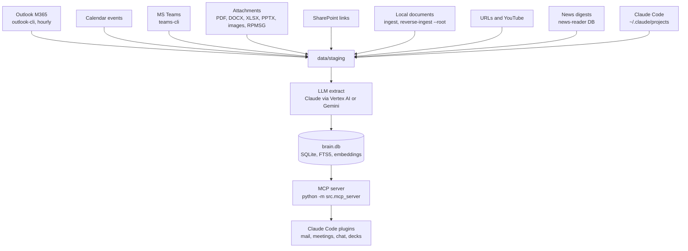

# second-brain

Personal knowledge repository and MCP data layer. It ingests emails, attachments, calendar events, Teams messages, SharePoint documents, news digests, and Claude Code conversation history into a SQLite database (`brain.db`), then exposes that store to Claude Code plugins via a Model Context Protocol (MCP) server.

The point: give the agent recall over years of institutional context (people, decisions, action items, topics, key facts) without re-reading every message on every turn.

[](https://github.com/weirdapps/plessas-second-brain/actions/workflows/ci.yml)
[](LICENSE)

Python 3.12+. MIT-licensed. Maintained by [@weirdapps](https://github.com/weirdapps).

## What it does

Four stages, run on a schedule:

1. **Ingest.** Pull new mail, attachments, calendar events, Teams messages, SharePoint links, standalone documents, URLs, YouTube transcripts, news digests, and Claude Code conversations into `data/staging/`.
2. **Extract.** Send raw content through an LLM (Claude via Vertex AI by default; Gemini optional) to produce structured JSON: summary, sentiment, urgency, topics, decisions, action items, people, key facts.
3. **Load.** Write rows into SQLite with FTS5 full-text indexes, embedding vectors, and thread reconstruction. Schema migrations run automatically.
4. **Serve.** Expose the store as MCP tools that Claude Code plugins (`mail`, `meetings`, `chat`, `decks`, and more) call directly.

## Architecture


```mermaid
graph TD
    O[Outlook M365<br/>outlook-cli, hourly] --> S[data/staging]
    C[Calendar events] --> S
    T[MS Teams<br/>teams-cli] --> S
    A[Attachments<br/>PDF, DOCX, XLSX, PPTX, images, RPMSG] --> S
    P[SharePoint links] --> S
    L[Local documents<br/>ingest, reverse-ingest --root] --> S
    W[URLs and YouTube] --> S
    N[News digests<br/>news-reader DB] --> S
    K[Claude Code<br/>~/.claude/projects] --> S
    S --> E[LLM extract<br/>Claude via Vertex AI or Gemini]
    E --> D[(brain.db<br/>SQLite, FTS5, embeddings)]
    D --> M[MCP server<br/>python -m src.mcp_server]
    M --> CC[Claude Code plugins<br/>mail, meetings, chat, decks]
```

## Ingestion sources

| Source | Module | Notes |
| --- | --- | --- |
| Microsoft 365 mail | `src/export/outlook_export.py` + `outlook_cli.py` | Primary. Hourly, one `--since` cursor per folder. |
| Attachments | `src/export/outlook_attachments.py`, `src/extract/attachment_extractors.py` | PDF (PyMuPDF), DOCX (`python-docx`), PPTX (`python-pptx`), XLSX (`openpyxl`), XLSB (`pyxlsb`), XLS (`xlrd`), images (Tesseract OCR, a grayscale second pass when colour finds too little), EML and clear-signed `.p7m`, `.mso` object containers (the workbooks behind charts pasted into mail), `.wmz`/`.emz` drawings (their text records), and text formats routed by their bytes (ICS, VCF, XML, SVG, EPS, VTT). Files encrypted at rest (rights-protected Office files and `.rpmsg` messages, password-protected Office files and PDFs) are recognised from their bytes and recorded as `extraction_status = 'encrypted'`, method `rms`, `rms-message` or `password`: nothing reads them without the key. |
| Inline email images | `src/extract/image_classifier.py`, `image_pipeline.py`, `image_vision.py` | Dimensions plus bytes plus sender-scoped SHA256 dedup cascade; vision LLM stage for content images, cached by SHA256. |
| Calendar events | `src/export/calendar_export.py`, `src/extract/calendar_extractor.py` | Outlook events with attendees, body summary, decisions. |
| MS Teams | `src/export/teams_cli.py`, `teams_export.py`, `src/extract/teams_pipeline.py` | Chats, threads, messages, MRI resolution. |
| WhatsApp | `scripts/whatsapp_snapshot.py`, `src/export/whatsapp_export.py`, `src/extract/whatsapp_pipeline.py` | A minimized snapshot pushed hourly from the Mac that runs a WhatsApp bridge; sessions extracted and embedded like Teams threads. See [WhatsApp](#whatsapp). |
| SharePoint links | `src/extract/sharepoint_url_scanner.py`, `src/export/sharepoint_fetcher.py` | Managed host defaults to `contoso.sharepoint.com` (override via `SHAREPOINT_HOST`). |
| Standalone documents | `src/cli.py ingest`, `reverse-ingest`, `src/ingest/reverse_scan.py` | Latest-version-per-logical-name dedup. `reverse-ingest` scans only the directories you name with `--root`; nothing schedules a scan. |
| Web and YouTube | `src/extract/web_ingest.py` | URL fetch plus transcript pull via `youtube-transcript-api`. |
| News digests | `src/export/news_export.py` | Reads an external news-reader SQLite DB (`BRAIN_NEWS_DB`) read-only. Digest syntheses plus articles at or above `--relevance`. Landed under `mailbox_name = 'News'`, so mail counts exclude them. Not sent to the model: the summary is the synthesis's brief or the article's opening, the topics its section categories or the article's categories (`src/extract/news_extract.py`). |
| Claude Code sessions | `src/export/conversation_export.py` | Reads `~/.claude/projects`. |

### Bring your own source

The extract → load → serve chain is **source-agnostic**: it only reads staging batches from `data/staging/batch-*.json`. The Microsoft 365 adapters above are just one way to fill that folder. To ingest from any other system (Gmail, IMAP, an `.mbox`, a custom API), write a small exporter that emits the same JSON shape. No other code changes are needed.

A staging batch is `{ "batch_number", "exported_at", "source", "folder", "emails": [ … ] }`, where each email record is:

```json
{
  "message_id": "any-stable-unique-id",
  "date_received": "2026-01-15T09:00:00Z",
  "subject": "…",
  "sender":        { "name": "…", "address": "…" },
  "to_recipients": [{ "name": "…", "address": "…" }],
  "cc_recipients": [],
  "mailbox_name": "Inbox",
  "content": "plain-text or HTML body",
  "conversation_id": "optional, for threading",
  "internet_message_id": "optional, for cross-source dedup"
}
```

An HTML `content` is recognised by how it opens: a document or block-level tag (or `span`, `font`, `br`, `img`), a comment, a doctype, or an XML prolog followed by one of those; `looks_like_html` in `src/extract/html_text.py` has the list. It is stored as the text a reader sees, with the markup kept beside it; a body that opens with text is stored as it came.

See [`examples/example_exporter.py`](examples/example_exporter.py) for a ~40-line reference exporter and [`examples/sample-batch.json`](examples/sample-batch.json) for a complete synthetic batch. Drop a batch into `staging/` under the data home (`<repo>/data` unless `BRAIN_DATA_DIR` moves it). On a fresh store, run `python -m src.extract.local && python -m src.cli load`: `load` creates the database but does not extract, and `sync` needs the database to exist. From then on `python -m src.cli sync` does both.

## MCP tools

The MCP server exposes 27 tools (all defined in `src/mcp_server.py`). Register the server once with `claude mcp add` (see [Register with Claude Code](#register-with-claude-code)), then every session picks them up.

**Response budget.** Claude Code saves a tool result longer than 50,000 characters to a file and hands the model a path instead. `recall`, `search_emails`, `query_emails`, `search_attachments`, `search_conversations`, `search_teams`, `query_decisions` and `query_calendar_events` therefore hold their answer to 40,000 characters, measured on the indented JSON the server sends (`src/mcp_budget.py`). Over that, rows are cut from the tail of whichever list holds the most characters, and `truncated` names each list that lost rows as `{"kept": n, "total": m}`; ask again with a narrower query or a lower `limit` for the rest. `search_emails`, `query_emails`, `search_attachments`, `search_conversations` and `query_decisions` return their rows as `{"result": [...]}`, which is also what their structured content always was.

**Contract.** Every tool is annotated read-only, idempotent and closed-world, so a client may run several at once, except `outlook_live_search` (open-world: it reads the live mailbox) and `sharepoint_index` (not read-only: `refetch` records what it fetched). Choices are enums and every `limit` has bounds in the input schema, so a bad value is refused before the tool runs. Every tool declares an output schema (`src/mcp_results.py`), so results also go out as compact `structuredContent`. A failure (a malformed argument, an unknown id, a missing filter, a refused SQL statement) is a tool error, `isError: true`, whose message says what to do next; "nothing matched" is an empty list with a `reason`.

### News and automation are left out by default

Every row of the `emails` table has a `source_class` (schema v33, rules in `src/store/source_class.py`): `mail`, `automation` (the reports your own jobs mail you), `news`, `document` (standalone documents, SharePoint files and pages, web imports) or `session_note` (notes Claude sessions wrote). Every tool that reads mail or what was extracted from it (`recall`, `search_emails`, `query_emails`, `person_context`, `topic_context`, `meeting_prep`, `query_decisions`, `query_actions`, `stale_threads`, `search_attachments`, and `sender_brief` through `person_context`) leaves out `news` and `automation` unless you pass `include_news=true` or `include_automation=true`. Documents and session notes stay in. Every row drawn from an email carries its `source_class`; a decision or action whose parent is not an email (Teams, WhatsApp, a meeting, a conversation) carries `null` and is never filtered. On a store older than v33, as a replica's is between new code and its next pull, only `news` is left out; `recall`'s `summary.source_class` and `stats` say so.

This changes results: decisions, actions and key facts from news items and from your automation mail no longer appear in "what did we decide" or "what do I owe" answers unless asked for. Before v33 only `query_decisions`, `query_actions` and the overdue half of `stale_threads` left out news, and nothing left out automation.

### Unified recall

- `recall(query, limit_per_kind, days, include_context, include_news, include_automation)`. Fan-out across every text-bearing index. This is the default "tell me everything you know about X" entry point.

  Ten result buckets, keyed exactly as returned: `emails` (which also covers standalone documents and news, since they share the `emails` table), `attachments`, `conversations`, `decisions`, `actions`, `commitments`, `inline_images`, `teams`, `whatsapp`, `calendar_events`. `summary.kinds_with_results` names the ones that matched.

  The answer leads with what decides how far to trust it: `summary` (its first key `semantic`), then `data_as_of` and `stale`, then `_stale_warning` when the local database is behind, then `truncated` when the budget cut rows, and only then the buckets. A result too big to show inline used to end with these, where the preview of the saved file could not see them. `limit_per_kind` is 1 to 10 (default 5). Rows carry summaries cut to about 300 characters, and no `snippet` that only repeats the row's subject, title or summary.

  `include_context` (default `false`) attaches the person and topic dossiers the query matches, as `person_context` and `topic_context`, with `summary.has_person_context` and `has_topic_context`. They used to be attached to every call: 27% of an average payload, often for the wrong entity, since a topic word can start a person's name. Call `person_context` or `topic_context` directly for a full dossier.

  Only the `emails` bucket is a keyword plus semantic fusion (reciprocal rank fusion over FTS5 and embedding hits, degrading to keyword-only if the index or credentials are absent). Every other bucket is keyword-only. News and automation are left out of every bucket, the semantic candidates and both dossiers unless included (see above).

  A search embeds its query with a 4-second timeout and at most one retry (a 4xx other than 429 is not retried), never the ingest job's two-minute backoff. When the query cannot be embedded, semantic search ranks around the vectors of the query's best keyword matches instead, and says so: `summary.semantic` in `recall`, and each row's `semantic` in `search_emails` and `search_conversations`, read `keyword_seeded: <error type>`. With no keyword match to stand in, `recall` reports `unavailable: <error type>` and stays keyword-only.

### Emails

- `search_emails(query, search_type, limit, include_news, include_automation)`. Keyword (FTS5) or semantic (embedding). Keyword search tries the subject first, then the summary, the body, key facts and attachments, and returns one email per thread (for a subject match, the thread's newest); a row whose thread has more than one email matching in its subject, summary or body says how many in `thread_matches`. Semantic search leaves the vectors of news and automation mail, and of their attachments, out of the ranking unless included.
- `email_thread(email_id, limit)`. The emails of a hit's thread, oldest first, with `thread_total`; a thread longer than `limit` comes back as the `limit` emails centred on the hit, and a News item or an email with no conversation id as a thread of one. The thread asked for comes back whatever its class, each row saying its `source_class`.
- `query_emails(person, topic, keyword, start_date, end_date, limit, include_news, include_automation)`. Combined filters.
- `outlook_live_search(folder, since_minutes, subject_contains)`. Bypasses the DB and queries the live Outlook mailbox directly, for mail newer than the store. `since_minutes` defaults to 60 and is capped at 1440 (24 hours); the answer's `since_minutes` and `clamped` say what was searched. This is the escape hatch when `stats` says the local copy is stale.

Mail deleted or junked in Outlook keeps the folder it had, where it used to be relabelled `Archive` like mail moved there; where it went, and when it was first seen deleted, is recorded beside it (see [Database schema](#database-schema)). Nothing is removed from the store: these tools still return it.

### People and topics

- `person_context(name_or_email, days, limit, include_news, include_automation)`. History, sentiment, decisions, open actions, communication pattern, `teams`: the messages they wrote in the window and the threads they wrote in (`recent_threads`, with `recent_threads_total`), and `whatsapp`, the same for WhatsApp, matched on a name of two words or more against sender names, since WhatsApp has no address to join on. Each list is capped at `limit` (default 20) and carries a `<name>_total` sibling with the real count, so a truncated answer is distinguishable from a complete one. A name is matched ignoring case and accents; when several people match, the most-emailed one is used and `match_count` / `other_candidates` say who else it could be (`sender_brief` and `meeting_prep` resolve names the same way).
- `topic_context(topic, days, limit, include_news, include_automation)`. Key people, decisions, actions, facts. Same `limit` and `<name>_total` contract.
- `sender_brief(name_or_email, days)`. Compact briefing suitable for inline display.
- `meeting_prep(people, topic, days, include_news, include_automation)`. Per-attendee dossiers, optionally scoped to a topic.

Every dossier dates and orders its rows the same way (`src/store/ordering.py`): decisions newest first by their own date when it is an ISO date, else by their parent's (the email, Teams or WhatsApp session, meeting or conversation they came from); key facts newest parent first; open actions upcoming first, soonest first, then undated, then overdue, most recently missed first. Every decision, fact and action row carries `date` and `parent_date`.

### Decisions and actions

- `query_decisions(topic, person, days, limit, include_news, include_automation)`.
- `query_actions(owner, status, limit, include_news, include_automation)`.
- `stale_threads(days, limit, max_days, include_news, include_automation)`. Threads whose last message you sent between `days` and `max_days` (default 30) ago, plus overdue action items from every source but news and automation; both lists newest first, capped at `limit`, with `stale_threads_total` and `overdue_actions_total` giving the untruncated counts. The stale-thread half needs `BRAIN_USER_EMAIL_PATTERN`; without it that half is always empty and the response says so.

### Attachments and images

- `search_attachments(query, limit, include_news, include_automation)`. FTS over extracted text and LLM summaries; each row carries its email's `source_class`. Since 2026-10-11 a long attachment's summary is built from part of it: a spreadsheet's from its structure, any other long text's from three of its parts (see [Attachment summaries and spend](#attachment-summaries-and-spend)). The full extracted text is still searched.
- `attachment_image_search(query, limit)`. Case- and accent-blind match on vision descriptions of classified content images: the whole query first, then any meaningful word (`partial_match`).

### Calendar

- `query_calendar_events(person, since, until, keyword, limit)`. Times come back as `start_at`/`end_at` in UTC (a trailing `Z`) and as `start_local`/`end_local` in Europe/Athens with the offset. A bare-date `since`/`until` is an Athens calendar day, and `limit` is capped at 200. A meeting Outlook no longer lists is kept as cancelled and left out. Each event lists its first 10 attendees, the ones `person` matched first, with `attendees_total` counting them all (events average about 48 attendees and reach 500), and `response_status` is your own response. For the full list, `sql_query` on `event_attendees`.

### Teams

- `search_teams(query, kind, limit)`. Thread summaries, message text, or both.
- `teams_thread_context(thread_id)`. Full thread with decisions, actions, facts.
- `teams_chat_summary(chat_id, days)`. Recent activity per chat or channel.

A channel thread holds the post and its replies, each reply a message of its own, and a post is dated by when it was written, not by its newest reply. A message edited or deleted after it was first stored is brought up to date on a later pull: the edit replaces the text, a deletion blanks it, and either sends the thread back to extraction. Before this, replies stayed inside the post's stored payload, out of search and extraction, and the first draft of an edited message and the text of a deleted one were kept. `python -m src.cli teams-backfill-replies` stores the replies already held in stored posts, once (see `docs/DEPLOY.md`).

### WhatsApp

- `search_whatsapp(query, chat, days, limit)`. Session summaries and raw message text, newest first, one row per session. `chat` narrows to chats whose name contains it (or one exact JID); `days` to sessions active in the window.

### SharePoint

- `sharepoint_index(operation, url)`. `list_stale` (any link whose `last_status` is not `ok` or `not-content`), `list_unfetched`, or `refetch` a specific URL.

  What a link points at decides what is fetched (`link_kind` in `src/export/sharepoint_fetcher.py`): a file (a sharing link to a document, an Office viewer URL, a document URL) is downloaded through `sharepoint-cli get` and stored as text; an intranet page (`/SitePages/*.aspx`) is read through `sharepoint-cli page` and stored as a text-only document titled `[SharePoint page] <title>`; anything else (the SharePoint home, OneDrive and library views, folders, videos) is recorded once as `not-content` and never fetched. Links to the same target share one fetch per run.

  `refetch` accepts only a URL already present in `sharepoint_links` and only on the configured `SHAREPOINT_HOST`. Both checks matter: the URL reaches `sharepoint-cli --host` and the CLI will point the stored session, cookies included, at whatever host it is given. Since search results carry attacker-authored subject and body text to the model, an unconstrained refetch is a route for sending your SharePoint session to a tenant someone else controls.

### Claude Code conversation memory

- `search_conversations(query, search_type, workspace, limit)`.
- `conversation_context(session_id)`.
- `recall_preference(topic, limit)`. Surface prior user preferences and corrections extracted from past sessions.
- `recent_conversations(workspace, days, limit)`.

### Stats

- `stats()`. Counts across emails, news articles, standalone documents, conversations, topics, people, decisions, actions, attachments, key facts and calendar events, plus `coverage`: the first and last date held per mailbox, Teams, WhatsApp, calendar and conversations, and `source_class`: the emails of each class, or `"pending migration"` on a store older than v33. Check it before reading an empty answer as 'nothing happened'.

  It also returns `data_as_of`, `age_hours` and `stale`. `data_as_of` is the older of two stamps, both returned as stored: `last_sync_date`, which every `sync` writes, and `mail_export_ok_at`, the Inbox export's last success, which `sync` copies in. `stale_warning` names the one that is behind. On a read replica that is the only way to tell a live corpus from one whose feed stopped, because both answer queries identically.

  `embed_backend` names the service that embeds this server's search queries (`gemini` or `vertex`, see `BRAIN_EMBED_BACKEND`), and `last_embed_error` the last query embedding that failed in this server process, as `{"type": <exception type>, "at": <UTC time>}`, or `null`. It carries no message text, which can quote a query or a credential error.

### SQL (read-only)

- `sql_schema(table=None)`. Without a table, every table and view with its row count; with one, its columns and indexes. `rows` is null for full-text (virtual) tables, which are marked `"virtual": true`, and also where counting ran out of the shared time budget (or a view cannot be counted). Full-text shadow tables are left out of the list.
- `sql_query(sql, limit=200)`. One read-only `SELECT` (or `WITH ... SELECT`) against `brain.db`, for counts, trends and aggregates the curated tools cannot express, and for the full text they only summarise: `emails.content`, `teams_messages.content_text`, `attachment_content.extracted_text`, `conversation_turns.content`. `sb_fold(text)` folds case, Greek accents and final sigma, so fold both sides: `WHERE sb_fold(subject) LIKE '%' || sb_fold('term') || '%'`.

  It cannot write: the connection is read-only with `query_only` on, and a SQLite authorizer allows nothing but reading. One statement per call, a 10 s budget, at most 200 rows, 4,000 characters per cell (a cut cell ends `… [cut, N chars]`, N its full length) and 100,000 per answer; binary values come back as `<N bytes>`, and `truncated` says when something was left out. A result wider than 32 columns is refused (name the columns you need), and so is a query that reads or builds a value over 8 MiB: read long text with `substr()`. On a replica (the pull stamp exists) it opens with `immutable=1`, the only read-only open that works on a pulled copy.

## WhatsApp

A WhatsApp bridge (a whatsmeow client) runs on one Mac and keeps the phone's chats in a local SQLite store. That store never leaves the Mac. What does is a minimized snapshot, and only this path touches it:

1. **On the Mac, hourly at :50**, LaunchAgent `com.plessas.whatsapp-sync-vps` runs `scripts/wrappers/launchd/sync-whatsapp-to-vps.sh`. It calls `scripts/whatsapp_snapshot.py` (stdlib, Python 3.9, for `/usr/bin/python3`), which opens the bridge store read-only and writes a new file holding `chats(jid, name)` and `messages(id, chat_jid, sender, content, timestamp, is_from_me, media_type, filename)`, and nothing else.
2. The wrapper makes `~/.second-brain/whatsapp` 0700 on the producer, copies the snapshot there as `.part`, checks its size, sets it 0600 and renames it into place, then writes `whatsapp-sync.stamp` on both hosts (or `whatsapp-sync.fail` with the reason when a run fails).
3. **On the producer, at :55** (`sb-whatsapp-sync.timer`), `python -m src.cli whatsapp-sync` upserts chats and messages on `(chat_jid, message_id)`, gap-bounds sessions per chat (8 h, continued across runs), extracts each new or changed session through the same Vertex route as Teams threads, and embeds the session summaries into `embeddings.npz` at `WHATSAPP_THREAD_ID_OFFSET - id`.

From then on WhatsApp is a source like Teams: `search_whatsapp`, the `whatsapp` bucket of `recall`, decisions and actions with `source = 'whatsapp'`, `person_context`, `stats` and `coverage`.

### Privacy properties

- **What leaves the Mac** is the snapshot and nothing else. The bridge also stores, per media message, the CDN URL, the media key and the file hashes, which together download and decrypt that photo or voice note; the snapshot is built from an allowlist of columns, and a test reads its raw bytes to prove none of them survived. The bridge's own store is opened read-only and never written.
- **Owner-only at every hop.** The snapshot is built under umask 077 in a private temporary directory that is removed on exit; it lands 0600 in a 0700 directory on the producer; `brain.db` is 0600 there, and the Mac's replica is now pulled 0600 in a 0700 directory as well (`sb-db-pull.sh`).
- **No message in any log.** The snapshot builder and both wrappers log counts only, and the bridge's own stdout, which prints every message, is not involved.
- **Where the content goes** is where every other source's goes: `brain.db`, the vectors of its summaries, the model provider configured for extraction and embeddings (Vertex AI), and the encrypted offsite snapshots and host backups of `brain.db`. Credentials inside messages are redacted before any of that (`src/redact.py`).
- **This repository** holds code and synthetic fixtures only. Where the bridge keeps its store is host configuration (`SB_WHATSAPP_SOURCE` in the installed plist), not a path in this public tree.

### Deploy

On the **producer**, after pulling this repository and reinstalling (schema v26 applies on the next connection):

```bash
cp scripts/wrappers/systemd/sb-whatsapp-sync.sh ~/.local/bin/
# ~/scripts/run-sb-whatsapp-sync.sh: a copy of run-sb-teams-sync.sh that execs sb-whatsapp-sync.sh
```

```ini
# ~/.config/systemd/user/sb-whatsapp-sync.service
[Unit]
Description=second-brain WhatsApp sync

[Service]
Type=oneshot
ExecStart=%h/scripts/run-sb-whatsapp-sync.sh
TimeoutStartSec=600

# ~/.config/systemd/user/sb-whatsapp-sync.timer
[Unit]
Description=second-brain WhatsApp sync, after the Mac's :50 push

[Timer]
OnCalendar=*-*-* 01,07,08,09,10,11,12,13,14,15,16,17,18,19,20,21,22:55:00 Europe/Athens
RandomizedDelaySec=120

[Install]
WantedBy=timers.target

# ~/.config/systemd/user/sb-whatsapp-sync.service.d/healthcheck.conf
[Unit]
OnSuccess=hc-success@sb-whatsapp-sync.service
OnFailure=hc-fail@sb-whatsapp-sync.service
```

The Healthchecks check `sb-whatsapp-sync` must exist before the first run. Install the Mac side first, so the first run finds a snapshot rather than exiting 66, then `systemctl --user daemon-reload && systemctl --user enable --now sb-whatsapp-sync.timer`.

On the **Mac that runs the bridge**, after pulling this repository:

```bash
cp scripts/wrappers/launchd/sync-whatsapp-to-vps.sh scripts/wrappers/launchd/sb-db-pull.sh ~/.local/bin/
sed -e "s|__HOME__|$HOME|g" -e "s|__WHATSAPP_STORE__|/path/to/the/bridge/store/messages.db|g" \
  scripts/wrappers/launchd/com.plessas.whatsapp-sync-vps.plist \
  > ~/Library/LaunchAgents/com.plessas.whatsapp-sync-vps.plist
launchctl bootstrap gui/$(id -u) ~/Library/LaunchAgents/com.plessas.whatsapp-sync-vps.plist
launchctl kickstart gui/$(id -u)/com.plessas.whatsapp-sync-vps   # the first push
```

**First backfill**: `systemctl --user start sb-whatsapp-sync.service` on the producer once the first push has landed. Extraction is deadline-bounded (300 s a run), so a large first backlog drains over a few hourly runs; starting the service again drains it faster. Check with `python -m src.cli stats` (`whatsapp_messages`, `coverage.whatsapp`) and the nightly health report's WhatsApp line.

## Installation

Requires Python 3.12+ and, if you ingest attachments, system packages that `pip` cannot install:

- **`tesseract` plus its language data.** Attachment OCR calls `pytesseract.image_to_string(img, lang="eng+ell")`, so the English *and* Greek traineddata must both be present or every image and scanned PDF fails. `pytesseract` is a wrapper around the binary, not the binary. In a corpus with scanned documents in it, OCR ends up the most common extraction method of all.
- **`antiword` (or `catdoc`) on Linux**, for legacy Word `.doc` attachments. macOS converts them with its built-in `textutil`; a Linux host with neither records every `.doc` as skipped, which no failure count reports.
- **`zstd` and `openssl`**, only if you want the encrypted offsite backups from `scripts/backup_db.py`. Missing either one silently downgrades to local-snapshot-only.

```bash
brew install tesseract tesseract-lang                  # macOS
sudo apt-get install tesseract-ocr tesseract-ocr-ell   # Debian/Ubuntu
sudo apt-get install antiword                          # Debian/Ubuntu, legacy .doc
tesseract --list-langs | grep -x ell                   # verify the Greek pack
```

Microsoft 365 ingestion needs three separate open-source CLIs, one per surface: [`outlook-cli`](https://github.com/weirdapps/outlook-access) for mail, attachments and calendar, [`teams-cli`](https://github.com/weirdapps/teams-access) for Teams, and [`sharepoint-cli`](https://github.com/weirdapps/sharepoint-access) for SharePoint reference links. They share no session and each logs in separately. Everything else (local documents, URLs, YouTube, news, Claude Code conversations, or your own exporter) works without any of them.

```bash
# HTTPS (no SSH key required):
git clone https://github.com/weirdapps/plessas-second-brain.git
# or, with SSH:
git clone git@github.com:weirdapps/plessas-second-brain.git

cd plessas-second-brain

python3.12 -m venv .venv
source .venv/bin/activate

# uv is the canonical package manager (uv.lock is committed):
uv pip install -e ".[dev]"

# pip also works:
pip install -e ".[dev]"
```

## Configuration

Read from environment variables. Only identity plus one extraction path (Vertex or Gemini) is strictly required.

Four identity and tenant settings (`BRAIN_USER_NAME`, `BRAIN_USER_ROLE`, `BRAIN_USER_EMAIL_PATTERN`, `SHAREPOINT_HOST`) can also live in a per-host file, `~/.config/second-brain/env` (override the path with `BRAIN_CONFIG_FILE`), one `KEY=value` per line, `#` comments allowed. `src/config.py` applies it at import, and the environment wins over it. It exists because the processes that need these settings may start without a login shell: Claude Code passes the MCP server the environment `claude` itself was launched with, which from a GUI or an IDE holds no shell profile, and systemd starts the timers with a fixed one. Any other key in the file is ignored, so a credential, a backend switch or a relocated data home pasted into it is never picked up. Nothing reads a `.env` file; the schedulers that want one source it themselves.

### Identity

Used in extraction prompts and stale-thread detection.

- `BRAIN_USER_NAME`
- `BRAIN_USER_ROLE`
- `BRAIN_USER_EMAIL_PATTERN` (case-insensitive substring, matched against `sender_address` to detect your sent mail)

### Extraction engine

- `BRAIN_EXTRACT_ENGINE`: `claude` (default) or `gemini`.
- `CLAUDE_EXTRACT_MODEL` or `VERTEX_MODEL_EXTRACT`: Claude model override (default `claude-sonnet-4-6`).
- `BRAIN_GEMINI_MODEL`: Gemini model override (default `gemini-2.5-flash`).
- `BRAIN_TEAMS_MODEL`: override for Teams thread extraction.

### Vertex AI

Preferred credential path. Uses Application Default Credentials, no API key required.

- `VERTEX_SDK_PROJECT` or `ANTHROPIC_VERTEX_PROJECT_ID`: GCP project id.
- `VERTEX_SDK_REGION` or `CLOUD_ML_REGION`: region. Model-region pairing matters. Claude 4.7 and newer requires `eu`; 4.6 and older requires `europe-west1`. A mismatch returns HTTP 429.
- `VERTEX_MODEL_FALLBACK_SDK` (default `claude-opus-4-6`, no `[1m]` suffix, because the SDK rejects brackets) and `VERTEX_REGION_FALLBACK` (default `europe-west1`): retry target on policy refusals. Set both together, or the retry hits the 429 described above. Since 2026-09-23 this tier differs from the extraction tier (`claude-opus-5-5` @ `eu`), so the same-pair guard in `vertex_fallback.py` no longer short-circuits the retry.
- `VERTEX_REGION_EMBED`: embedding region (default `europe-west1`).

### Alternative credentials

- `ANTHROPIC_API_KEY`: direct Anthropic API. Used only when no Vertex project is set; a key left in the environment never overrides Vertex. The backend in use is printed on stderr when the client is built.
- `GEMINI_API_KEY`: required when `BRAIN_EXTRACT_ENGINE=gemini` or `BRAIN_EMBED_BACKEND=gemini`.
- `BRAIN_EMBED_BACKEND`: `vertex` or `gemini`. Unset, it is `gemini` when `GEMINI_API_KEY` is set and `vertex` otherwise; set it to `vertex` to keep embeddings on Vertex on a host that holds a Gemini key for other reasons, such as `BRAIN_EXTRACT_ENGINE=gemini`. `gemini` reaches the same `gemini-embedding-001` through the Gemini API with `GEMINI_API_KEY`, even where a Vertex project is set, so its vectors join the existing index. Use it when the Vertex project refuses the embedding model. On a free-tier key Google may use the submitted text to improve its products; a key on a project with billing enabled is not used that way. The MCP server prints the backend it uses on stderr at startup, and `stats` returns it as `embed_backend`.

### Paths and hosts

- `SHAREPOINT_HOST`: SharePoint tenant you hold a session for (default: the placeholder `contoso.sharepoint.com`). The session is only ever presented to this host and its `<tenant>-my` OneDrive twin: a link to any other tenant is recorded as `unsupported-host` without a request, because `sharepoint-cli` attaches the session's cookies to whatever host it is given. `process-sharepoint` refuses to fetch until this is set, and `sharepoint_index(refetch)` refuses any URL off the tenant.
- `OUTLOOK_CLI_PATH`, `SHAREPOINT_CLI_PATH`: absolute paths to those two adapters. Set them for any process that does not inherit an interactive shell's `PATH`, which includes MCP servers, launchd agents and systemd units.
- `BRAIN_NEWS_DB`: the external news-reader SQLite database `news-sync` reads (default `~/SourceCode/news/data/news.db`). Read-only; no news ingestion happens without it.
- `BRAIN_ROLE`: `producer` or `replica`. A replica holds a copy of the database built on another host, and every command but the read-only ones (`query`, `stats`, `stale`, `prep`, the Teams readers) refuses to run there, as do the maintenance scripts and store modules that write and the MCP `sharepoint_index` refetch, since the next pull replaces what they would write. Without this variable a host is a replica when the pull job's stamp `~/.second-brain/db-pull.stamp` exists.
- `SECOND_BRAIN_VENV_PYTHON`: explicit venv override for `run_mcp.sh`.
- `BRAIN_DATA_DIR`: data home for the DB, attachments, staging, embeddings and SharePoint files. Attachment files are deleted once their content is stored, as described in [Files are inputs](docs/DEPLOY.md#10-files-are-inputs). Defaults to `<repo>/data`. Use an **absolute** path: `src/config.py` does not call `expanduser()`, and systemd's `EnvironmentFile=` does not expand `~` either, so a tilde produces a directory literally named `~`.
- The database file is `brain.db` inside `BRAIN_DATA_DIR`, so `<repo>/data/brain.db` by default. The global `--db` flag (placed before the subcommand, e.g. `python -m src.cli --db /path/brain.db stats`) overrides it.

`scripts/health_check.py` reads three more: `HEALTH_EMAIL_TO` and `HC_PING_URL`, documented in [`docs/DEPLOY.md`](docs/DEPLOY.md), and `BRAIN_DAILY_SPEND_WARN_USD` (below).

No credentials are printed by the code. All secrets are read from environment or (for Google) from ADC.

### Attachment summaries and spend

Phase 2 of the attachment pipeline (`process-attachments --phase 2`, the nightly pass, `reextract`) asks the model for one summary per document. Text up to 50,000 characters goes in one call, as before. A longer text is summarised from part of it, and the full extracted text stays stored for keyword search:

- **Spreadsheets** (text read by `openpyxl`, `pyxlsb` or `xlrd`) go in one call over a digest built from the stored cells (`src/extract/attachment_digest.py`): per sheet its name and size, header row, up to 20 sample rows (the first 15 and the last 5), each column's type with its minimum, maximum and mean or its distinct count, and up to 2,000 characters of free text; the whole digest stays under 30,000 characters. The prompt says it is a digest and asks for decisions and action items only from text that states them, not from table rows.
- **Any other long text** is summarised from three of its 40,000-character parts, its first, its last and the one richest in headings or table-of-contents lines, then a merge: four calls where it used to take up to 51.
- **A flagged attachment** keeps the old behaviour, up to 50 parts spread across it plus the merge, a long spreadsheet included. `python -m src.cli reextract --full-parts ID...` flags attachments by id (the `attachment_id` that `search_attachments` returns) and summarises them again now; the flag holds for every later summary. It is a `sync_metadata` row per attachment, key `attachment_summary_full:<id>`, so it needs no schema change; delete the row to lift it.

A run can be given a token budget, input and output tokens together: `--token-budget N` on `process-attachments` and `reextract`, or `BRAIN_ATTACHMENT_TOKEN_BUDGET` in the environment, which is how the nightly pass picks it up without a wrapper change (`--token-budget 0` lifts it for one run). Each call is estimated before it is sent, its prompt's characters at `BRAIN_CHARS_PER_TOKEN` characters a token (default 1.6, measured on this corpus's attachment prompts) plus 1,500 output tokens, and charged what the response reports once answered. The run stops before the first call that would pass the budget, leaves the rest pending for the next run (a long document keeps the parts it finished), prints how many it left, and exits 0. Calls already in flight finish, so with several workers a run can end a little over.

`--estimate` on either command prints how many calls and tokens the pending work (or the rows `reextract` would choose) would take, and its cost, without calling the model or changing anything. Rows `reextract` must read again first are estimated from the text they hold now, and rows that hold none yet are counted apart. Prices come from one rate table, `src/llm_cost.py`: Claude Sonnet 5.5 on Vertex AI's `eu` endpoint, in USD per million tokens 2.20 input, 11.00 output, 1.10 and 5.50 as a batch job, 0.11 for a cache read.

The nightly health check reports yesterday's spend (UTC) from the usage log every call writes, `llm-usage-YYYY-MM.jsonl` under the data home: an `LLM spend` row with calls, tokens and cost, and a line per call site. It is WARN above `BRAIN_DAILY_SPEND_WARN_USD` (default 60) or when a call used a model the rate table cannot price, and STALE when the store shows model work that day (mail that received a summary, attachment summaries written) but the log holds no call, which also fails the freshness ping. On a replica it reads N/A: the calls, and their log, are the producer's.

## Usage

### Run the MCP server

```bash
./run_mcp.sh
# or, directly:
python -m src.mcp_server
```

`run_mcp.sh` auto-detects the venv in this order: `$SECOND_BRAIN_VENV_PYTHON`, `./.venv/bin/python`, `./venv/bin/python`, `~/.venvs/second-brain/bin/python`, then `python3`. The script is portable across hosts (in-repo venv on macOS, out-of-repo `~/.venvs/` on the VPS).

Before it starts Python, `run_mcp.sh` sources the server's own environment file, `$BRAIN_DATA_DIR/env`, or `~/.second-brain/env` when `BRAIN_DATA_DIR` is unset. Put the settings the server needs whatever launched it there, one `KEY=value` per line (`export` is accepted), for example `GEMINI_API_KEY` and `BRAIN_EMBED_BACKEND`: Claude Code starts the server with the environment it was itself started with, which in an agent-team session or from an IDE holds no shell profile, and semantic search then fails quietly. Its values replace inherited ones. Because it holds keys, the file is read only when its mode gives group and others nothing (`chmod 600`); otherwise the server starts without it and says why on stderr. A symlink is judged by the file it points at.

To serve it over HTTP instead, for a client that cannot spawn it (one process then holds the embedding index for every request):

```bash
(umask 077 && mkdir -p ~/.config/second-brain && { [ -s ~/.config/second-brain/mcp-token ] || openssl rand -hex 32 > ~/.config/second-brain/mcp-token; })
BRAIN_MCP_TOKEN_FILE=~/.config/second-brain/mcp-token python -m src.mcp_server --http 127.0.0.1:8765
```

The endpoint is `http://127.0.0.1:8765/mcp`. Loopback only, and every request needs `Authorization: Bearer <token>`: the server refuses to start with a non-loopback host, a token file others can read, or a token under 32 characters. On the producer, run it with `BRAIN_ROLE=replica` so the one write path into `brain.db` (the `sharepoint_index` refetch) stays off; `docs/DEPLOY.md` section 9 has the systemd setup.

### Register with Claude Code

```bash
claude mcp add --scope user second-brain -- /absolute/path/to/second-brain/run_mcp.sh
claude mcp list    # second-brain should be listed as connected
```

`--scope user` makes the server available in every project. The server inherits the environment `claude` was launched with, which sources no `.env` and, from a GUI or an IDE, no shell profile, so put the identity settings in `~/.config/second-brain/env` (see [Configuration](#configuration)) and the embedding key and backend in the server's own owner-only environment file (see [Run the MCP server](#run-the-mcp-server)).

In any Claude Code session, ask "what do we know about X" and the agent calls `recall`. The `mail`, `meetings`, `chat`, and `decks` marketplace plugins consume these tools automatically.

### CLI

`./brain` (wrapper) or `python -m src.cli`. Highlights:

```bash
# Incremental sync over what `python -m src.export.outlook_export` staged: extract, load,
# register+process attachments, dedup people, embed, Claude Code conversations, inline
# images. Not Teams, calendar, news, SharePoint.
python -m src.cli sync --engine claude --workers 4

# Ingestion by source
python -m src.cli calendar-sync --since 2026-01-01
python -m src.cli news-sync --relevance 60
python -m src.cli teams-sync --workers 4
python -m src.cli teams-backfill-replies    # once, on the producer: store the channel replies stored posts hold; no Teams call
python -m src.cli whatsapp-sync             # the snapshot at BRAIN_WHATSAPP_SNAPSHOT (see WhatsApp below)
python -m src.cli process-attachments --phase 2 --workers 2
python -m src.cli process-attachments --phase 2 --estimate             # calls, tokens and cost of the pending summaries; no model call
python -m src.cli process-attachments --phase 2 --token-budget 2000000 # stop before passing 2M tokens; the rest stay pending
python -m src.cli process-images --limit 500
python -m src.cli process-sharepoint --since 2026-06-01   # a rescan by date; the nightly run continues past the last email id it scanned, fetching at most --max-fetches (100)
python -m src.cli split-html                # after v23, on the producer: HTML bodies loaded before it (see DEPLOY)
python -m src.cli reverse-ingest --root ~/path/to/documents --workers 4   # only the directories you name
python -m src.cli ingest ~/Downloads/report.pdf --source "Q2 report"
python -m src.cli ingest --url https://example.com/article

# Queries (CLI mirrors of the MCP tools)
python -m src.cli query keyword "budget approval"
python -m src.cli query semantic "concerns about digital transformation"
python -m src.cli query person "Duarte"
python -m src.cli query topic "cards migration"
python -m src.cli query decisions --topic cards
python -m src.cli query actions --owner Chen --status open
python -m src.cli query combined --person "Chen" --topic "digital"
python -m src.cli prep "Chen,Okafor" --topic digital
python -m src.cli stale --days 5
python -m src.cli stats

# Housekeeping
python -m src.cli migrate
python -m src.cli classify-sources          # set every email's source_class again, e.g. after BRAIN_USER_EMAIL_PATTERN is set
python -m src.cli embed --force
python -m src.cli prune-staged
python -m src.cli hash-attachments          # record a content hash for every attachment file still on disk
python -m src.cli sweep-files --policy      # delete attachment files whose content is stored (report-only by default)
python -m src.cli reextract --capped --zip --unread    # read and summarise again rows earlier code capped, skipped or never read
python -m src.cli reextract --partial                  # read again in full what the old readers read in part (resumable)
python -m src.cli reextract --stale --formats          # read with today's readers what older code skipped or failed on
python -m src.cli reextract --ocr --limit 500          # OCR low-text scans and images again (grayscale second pass), in batches
python -m src.cli reextract --long --estimate          # price a re-summary before running it; changes nothing
python -m src.cli reextract --full-parts 1234 5678     # summarise these attachments from every part, now and on every later summary
python scripts/relabel_attachment_status.py [--apply]  # give old failed/skipped rows today's unread verdicts: encrypted kinds, skip reasons
python -m src.cli ingest-session-notes [--all]         # notes Claude sessions wrote, as text-only documents
python -m src.cli process-sharepoint --ingest-fetched  # store the files earlier SharePoint fetches left on disk
python -m src.cli process-sharepoint --refetch-content --max-fetches 0 --deadline-s 1800  # read again the links recorded ok with no text
python -m src.cli mail-reconcile --since 2025-03-16 --json gaps.json   # Outlook messages the store lacks; read-only, so it runs on a replica
python -m src.cli mail-reconcile --since 2026-05-01 --refetch --record-aliases  # producer: stage them for the next sync, note the ids of Archive copies
python -m src.cli mail-reconcile --since 7d --refetch --limit 100 --health-json  # producer, nightly: the week's missing mail, and data/state/mail_loss.json for the health check
python -m src.cli retry-stubs [--dry-run]   # extract again the emails loaded without an extraction after failing three runs
```

Full subcommand list: `python -m src.cli --help`.

## Code layout

```text
src/
  cli.py                       Command-line entry (`brain` wrapper points here)
  config.py                    Paths, env-driven settings, schema version
  mcp_server.py                MCP server (MCPServer, mcp SDK v2), 27 tools
  bridge.py                    Legacy JSON-over-CLI bridge (superseded by MCP)
  llm_policy.py                Shared Vertex retry and auth policy (vendored, SHA256 drift-checked)
  llm_deadline.py              Derives PTS_LLM_DEADLINE from the calling unit's own budget
  llm_cost.py                  Rate table, a run's token budget, the usage log read back as spend
  export/
    outlook_export.py          Hourly Outlook ingestion via outlook-cli
    outlook_cli.py             outlook-cli subprocess wrapper
    outlook_attachments.py     Attachment fetch for Outlook messages
    calendar_export.py         Outlook calendar events
    conversation_export.py     Claude Code session transcripts
    news_export.py             News-reader digests and articles into staging batches
    teams_cli.py               teams-cli subprocess wrapper
    teams_export.py            Teams chats, threads, messages
    inbox_reconcile.py         Inbox to Archive move detection; Deleted Items and Junk as state
    sharepoint_fetcher.py      SharePoint link fetch and host classification
    sharepoint_cli.py          sharepoint-cli subprocess wrapper (cookie session, not bearer)
    state.py                   Atomic staging writes and the Outlook sync cursor
  extract/
    prompt.py                  Email extraction prompt
    attachment_prompt.py       Attachment summarization prompt
    teams_prompt.py            Teams thread extraction prompt
    untrusted.py               Fences third-party text in extraction prompts
    local.py                   Concurrent extraction dispatcher
    extraction_files.py        Where an email's extraction file lives; read back by the exact id
    news_extract.py            News items without the model: the synthesis brief or the article's opening
    parser.py                  Tolerant LLM JSON parser
    claude_extract.py          Claude via Vertex AI or direct API
    vertex_auth.py             Vertex AI credential resolution
    vertex_fallback.py         Model and region fallback on policy refusals
    policy_bridge.py           Maps SDK failures onto the shared policy; wires the re-auth callback
    attachment_pipeline.py     Two-phase pipeline (text extraction, then LLM)
    attachment_digest.py       A long spreadsheet's structure, summarised instead of its cells
    attachment_extractors.py   PDF, DOCX, PPTX, XLSX, XLSB, XLS, image, EML, RPMSG
    image_classifier.py        Dimensions plus bytes plus SHA256 dedup cascade
    image_vision.py            Vision LLM stage
    image_pipeline.py          Orchestration and backfill
    web_ingest.py              URL and YouTube ingestion
    calendar_extractor.py      Calendar body summarization
    teams_mri.py               Teams MRI to display-name resolution
    teams_pipeline.py          Thread extraction dispatcher
    teams_threads.py           Message to thread bounding
    sharepoint_url_scanner.py  Detect SharePoint URLs in email bodies
  store/
    schema.py                  Tables, FTS5 indexes, migrations
    loader.py                  Extracted JSON to SQLite
    query.py                   Person, topic, keyword, date, decisions, actions, FTS, combined
    source_class.py            What an emails row is (mail, automation, news, document, session note) and the default filter
    owner.py                   Whether an address is the owner's (BRAIN_USER_EMAIL_PATTERN), for the calendar and the source classes
    ordering.py                How decisions, key facts and actions are dated and ordered in every list
    context.py                 Rich person and topic context aggregations
    embeddings.py              Embedding index build and query
    recall.py                  Unified `recall` fan-out
    fusion.py                  Reciprocal rank fusion over keyword and semantic result lists
    normalizer.py              Greek-aware topic and people normalization
    dedup_people.py            Seven-phase people deduplication
    dedup_topics.py            One-time merge of topics differing only by case, accents, separators
    transliterate.py           Greek to Latin transliteration and name canonicalization
    fuzzy_people.py            Review-gated fuzzy name candidates; never auto-merges
    action_lifecycle.py        Dedups action items and ages out stale ones
    conversation_query.py      Claude Code conversation search
    teams_query.py             Teams thread, chat, and search
    sql_readonly.py            Read-only SQL over brain.db for the sql_query and sql_schema tools
    calendar_loader.py         Calendar event and attendee loader
  ingest/
    reverse_scan.py            Filesystem scan with latest-version-per-name dedup

scripts/
  health_check.py              Per-source freshness and job status; email + Healthchecks ping
  backup_db.py                 MVCC-safe encrypted DB snapshot + retention (see docs/RESTORE.md)
  recover_missing_extractions.py  Backfill emails that staged but never extracted
  repair_case_twins.py         Gives emails back their own extraction where a case twin's was stored (report by default)
  reap_orphan_attachments.py   Resolves attachment dirs the registrar can never claim
  scrub_secrets.py             Redacts credentials, card numbers, IBANs and passwords already in the DB or, with --files, in files (dry run by default)
  repair_people.py             Mends garbled people names and unsaved sender addresses (dry run by default)
  backfill-all.sh              One-shot backfill across all sources
  conversation-capture.sh      Helper to snapshot Claude Code sessions
  pii-gauntlet.sh              Guards tracked files (and, with --mode=history, published history) against personal-data leaks
  wrappers/                    Archive of the scheduler wrappers each host runs

examples/
  example_exporter.py          Reference "bring your own source" exporter
  sample-batch.json            A complete synthetic staging batch

docs/
  DEPLOY.md                    Prerequisites, bootstrap, scheduling, topology, health
  RESTORE.md                   Backup artefacts and the verified restore path

skill/
  recall.md                    Reference prompt for the recall workflow. Not installed
                               by anything: copy it to `.claude/skills/recall/SKILL.md`
                               or into a plugin to make it loadable
```

## Database schema

`data/brain.db` (SQLite). Migrations run automatically via `src/store/schema.py`; the current schema version is `CURRENT_SCHEMA_VERSION` in `src/config.py` and is tracked in the `schema_version` table.

- **Core content**: `emails`, `topics`, `email_topics`, `decisions`, `action_items`, `commitments`, `people`, `email_people`, `key_facts`, and from v23 `email_html`: an HTML body is stored as the text a reader sees, and the HTML is kept here, zlib-compressed, for the SharePoint link scan and the inline-image positions
- **Source class** (v33): `emails.source_class`, `NOT NULL DEFAULT 'mail'`, indexed (`idx_emails_source_class`). Set when a row is stored (the loader, `ingest_document`, `ingest_text_document`), by these rules, the first that matches:

  | Class | Rule |
  | --- | --- |
  | `news` | `mailbox_name = 'News'` |
  | `session_note` | `mailbox_name = 'External'` from `session-note@documents.local` |
  | `document` | any other `mailbox_name = 'External'` row |
  | `automation` | mail the owner (`BRAIN_USER_EMAIL_PATTERN`) sent to no one but himself, not a reply or forward, whose subject starts with a bracketed tag (`[VPS] ...`, `[nightly] ...`) or holds an ISO date, and names something besides that stamp. A tag alone is not enough: from anyone else, or also sent to someone else, it is `mail` |
  | `mail` | everything else, including whatever the rules are unsure of |

  The v33 migration classifies existing rows in one transaction, writing only the rows that are not `mail`. The owner rule needs `BRAIN_USER_EMAIL_PATTERN`, matched case-blind at the end of the address (its domain whole, its local part after a separator: `owner@example.com` matches `first.owner@example.com` but not `owner@example.com.example.net`), the same rule the calendar's self flags use. If it was unset when the migration ran, set it and run `python -m src.cli classify-sources`, which sets every row's class again by today's rules and writes only the rows that change. Reads use the stored class. A store without the column (older than v33), as a replica's file is from the new code's arrival to its next pull, is read as before the class: the `News` mailbox is left out and nothing else, rows are labelled from their mailbox (never `automation`), the process logs `source_class column missing; run migrate on the producer; news-only exclusion in effect` once, `recall`'s `summary.source_class` carries the same sentence and `stats` reports `source_class: "pending migration"`. Storing or setting a class needs the column: the writers and `reclassify()` (behind `classify-sources`, which migrates first) refuse such a store with an error that says to run `migrate`.
- **Attachments and images**: `attachments`, `attachment_content`, `inline_images`, `inline_image_occurrences`, `sender_signature_index`
- **Calendar**: `calendar_events`, `event_attendees`
- **Teams**: `teams_chats`, `teams_threads`, `teams_messages`, `teams_mri_resolution`
- **WhatsApp** (v26): `whatsapp_chats`, `whatsapp_threads`, `whatsapp_messages`; decisions, action items and key facts point back through `whatsapp_thread_id`
- **Conversations**: `conversations`, `conversation_turns`, `conversation_topics`
- **External refs**: `sharepoint_links`
- **FTS5**: `emails_fts` (summary, body and, from v22, subject, all accent-folded), `key_facts_fts`, `attachment_content_fts`, `conversation_turns_fts`, `conversations_fts`, `teams_messages_fts`, `teams_threads_fts`, `whatsapp_messages_fts`, `whatsapp_threads_fts`, `calendar_events_fts`
- **Metadata**: `sync_metadata` (per-source cursors), `schema_version`. `sync_metadata` also holds a row per stored email found in Outlook's Deleted Items or Junk Email, keyed `mail_location:<emails.message_id>`, with the JSON `{location, deleted_at, internet_message_id}`: `location` is `Deleted Items` or `Junk Email`, `deleted_at` the UTC time it was first seen in Deleted Items (null for Junk), and the Message-ID is normalised (no brackets, lower case). The hourly `src/export/inbox_reconcile.py` writes it when the email is first seen there, keeps it after the folder purges the email, and removes it when the email is back in the Inbox. The email row itself is never deleted or relabelled for it. A match by Message-ID says a copy is there: mail sent with a copy to oneself keeps another in Sent Items, which this does not list

`commitments` has no dedicated MCP tool and no CLI subcommand. The `commitments` bucket of `recall` is the only way to read it.

Thread identity: primary anchor is Outlook `ConversationId`; fallback is subject normalization with Greek `Re:` and `Fwd:` awareness.

## Development

### Tests

pytest suite under `tests/`, grouped into top-level tests plus focused subpackages (`tests/export`, `tests/extract`, `tests/mcp`, `tests/store`, `tests/teams`).

`tests/conftest.py` enforces two things for the whole session, so no individual test has to remember them. It redirects the data root to a temp dir in `pytest_configure` (before collection, because `src/config.py` resolves its paths at import time and an eagerly-importing test module would otherwise capture the developer's real `data/`), and it blocks socket creation outright. A test that genuinely needs the network marks itself `@pytest.mark.allow_network`; none does today. Both rules exist because tests that silently borrowed the maintainer's machine passed locally and failed on CI, twice.

```bash
pytest                              # full suite
pytest tests/test_mcp_server.py     # single file
pytest -k recall                    # filter by expression
pytest --cov=src --cov-report=term  # with coverage
```

Before and after changing how text is tokenised (stemming, prefix matching), run the regression guard. `scripts/retrieval_eval.py build` samples emails and keeps two words of each subject as a query; `run` reports how often keyword search returns the email, and its thread, first, in the top 5 and in the top 10. Compare the thread figures: replies share a subject, and a subject match returns one email per thread. It can show a loss, not a gain, because the queries are the subject's own words. The set holds subjects, so it is written to `~/.second-brain/retrieval-eval.json`, outside the repository, and both steps open the database read-only.

### Lint and format

`ruff` is **not** in the `dev` extra, so the install above does not provide it. CI pins an exact version because an unpinned ruff drifts and breaks the format check:

```bash
uvx ruff@0.16.8 check .
uvx ruff@0.16.8 format --check .
```

Pre-commit hooks are wired via `.pre-commit-config.yaml` (`ruff`, `mypy`, `gitleaks`, `yamllint` on workflows, `markdownlint`, plus a `pii-gauntlet` gate that blocks personal data from entering tracked files). Keep the pre-commit `ruff` rev and the CI pin in lockstep (both 0.16.8 today): ruff's formatter changes between versions, and a mismatch passes locally and fails on the runner.

### CI

- `.github/workflows/ci.yml`, on every push and PR to `master`, five jobs: `lint` (`ruff check` and `ruff format --check`), `test` (`uv sync --frozen --no-build --extra dev`, then `pytest` with coverage over `src` and `scripts`), `types` (`mypy` over `src/` and `scripts/`, pinned), `pii-gauntlet`, and `wrappers` (parses every script in `scripts/wrappers/` with the interpreter named in its shebang).
- `.github/workflows/sonarcloud.yml`: SonarCloud coverage upload (skipped on private repos by design; runs only when `SONAR_TOKEN` is present and the repo is public).
- `.github/workflows/dependabot-auto-merge.yml`: auto-merge for green Dependabot PRs.

Dependabot is configured for the `uv` ecosystem (see `.github/dependabot.yml`), so PRs update `uv.lock`.

### Scheduling

The pipeline is just CLI commands, so schedule them however you like. Examples:

- **cron** (hourly staging and sync): `5 * * * * cd /path/to/repo && .venv/bin/python -m src.export.outlook_export --folder Inbox >> ~/second-brain.log 2>&1`, then `7 * * * * cd /path/to/repo && .venv/bin/python -m src.cli sync >> ~/second-brain.log 2>&1`
- **macOS launchd** / **systemd timers**: wrap the same two commands (and `embed`) in a service unit pointing at your checkout and venv.

Typical cadence: staging and `sync` hourly, `embed` daily. `sync` stages no mail itself: it extracts and loads what `outlook_export` (or your own exporter) staged. Nor does it cover every source: `calendar-sync`, `teams-sync`, `whatsapp-sync`, `news-sync` and `process-sharepoint` each want their own schedule.

[`docs/DEPLOY.md`](docs/DEPLOY.md) has the full recipe, including the two-host shape (one producer that ingests, workstations that read an rsync'd replica) and the `loginctl enable-linger` without which `systemd --user` timers die at logout.

## Security

Report vulnerabilities via GitHub's private vulnerability reporting. See `SECURITY.md`.

Credentials are redacted on the way in (`src/redact.py`): every staging batch, extracted attachment text, Teams and WhatsApp messages, and calendar bodies before they reach the model. Card numbers (issuer range, length and Luhn check), IBANs (mod-97 check) and password values after a password key are masked at the same points, to the first six and last four digits, the country and last four characters, and the key; at load the decision, action item, commitment and key fact texts the model writes are masked again, and every extraction prompt tells the model not to copy such values. Rows stored before that existed are cleaned with `python scripts/scrub_secrets.py --apply` on the host that builds the database, with the jobs that write it stopped. It rewrites them under `secure_delete` and optimizes every full-text index, which removes what the run itself frees; `--vacuum` also drops copies freed by earlier churn, and needs free space of about twice the database. Snapshots taken before the scrub keep the old rows until retention ages them out. `scrub_secrets.py --files DIR ... --apply` masks the staged batches, extracted outputs and notes under each directory the same way. `scripts/pii-gauntlet.sh --mode=history` scans every line and filename ever committed, on every ref and on the pull-request heads fetched from `origin`, against the same checks as CI plus the private denylist.

## License

MIT. See `LICENSE`.
